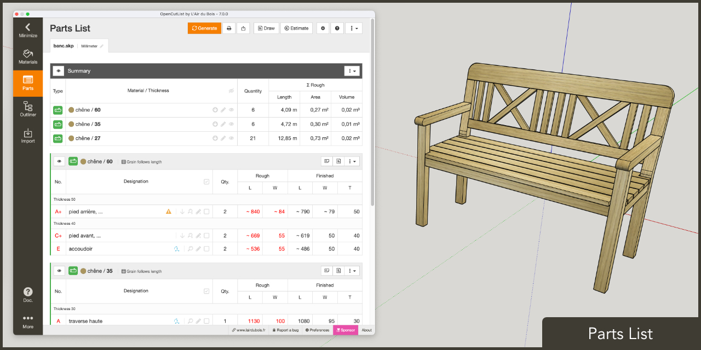
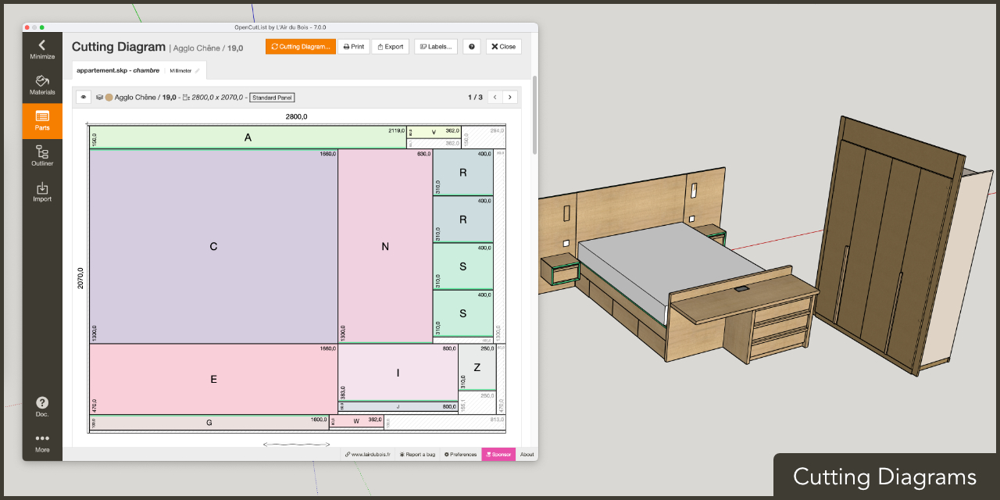
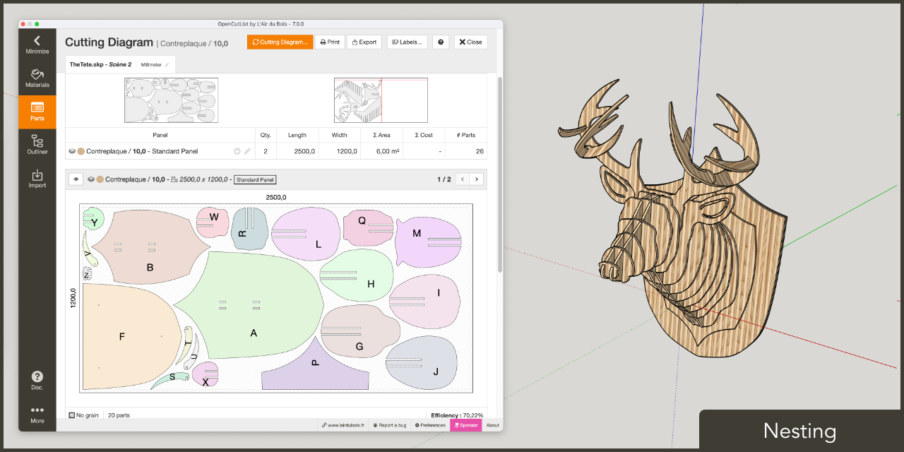
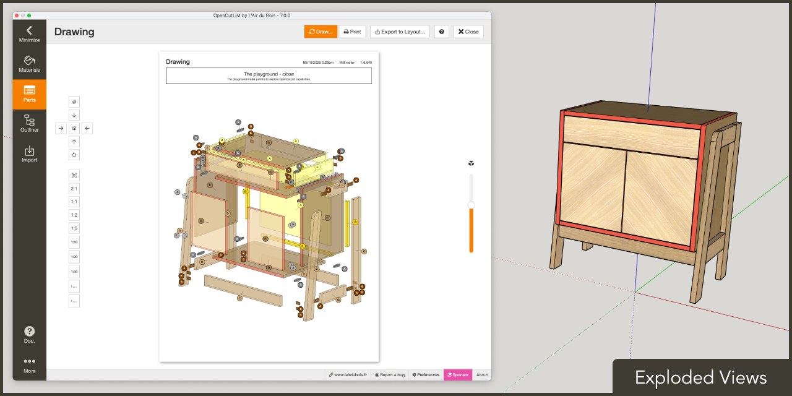
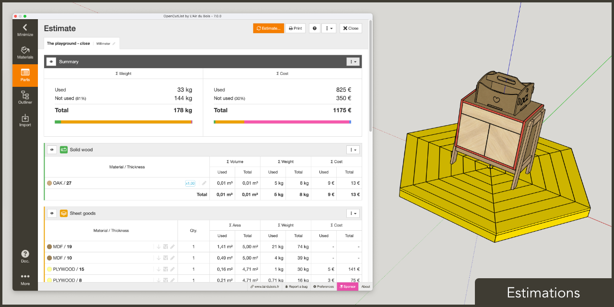
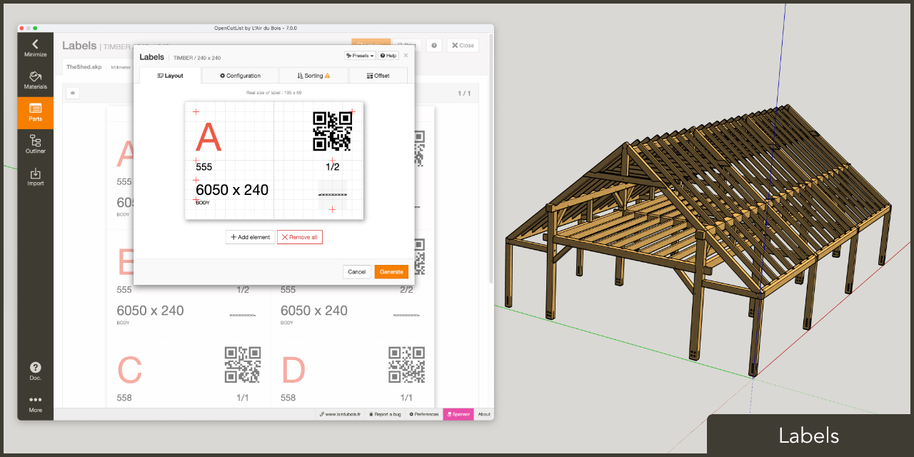

# OpenCutList by L'Air du Bois

**OpenCutList** is a [SketchUp](http://www.sketchup.com) Extension for automating the generation of a parts list, computing cutting diagrams, printing labels and generating cost and weight reports for woodworking projects.

## Download and Install

The signed ***.rbz** package is available from the [dist](dist) folder or from its official [Trimble Extension Warehouse](https://extensions.sketchup.com/en) page:

https://extensions.sketchup.com/extension/00f0bf69-7a42-4295-9e1c-226080814e3e/opencutlist

## Supported Languages

**OpenCutList** is available in French, English, German, Russian, Italian, Portuguese, Spanish, Polish, Czech, Vietnamese, Ukrainian, Dutch and Simplified Chinese. Experimental versions of Arabic and Hebrew are also available, although without RTL interface. The interface language of **OpenCutList** can be selected independently of the language version of SketchUp. Translators or reviewers can join us on [Transifex](https://www.transifex.com/opencutlist/opencutlist/) and actively participate in improving the quality of the translations.

## Supported Units

In addition to the selected SketchUp unit, **OpenCutList** works with dimensions of solid wood, panels and dimensional lumber in fractional inches, even if the selected SketchUp units are metric and vice versa.

## FAQ

A few frequently asked questions are listed [here](docs/02-faq.md).

## Documentation

[Documentation](https://docs.opencutlist.org/) for **OpenCutList** is available.

## Tutorials

There are a number of great videos on YouTube about using **OpenCutList** for woodworking projects.

- 🇫🇷&nbsp;&nbsp;**Boris Beaulant** | [Conférence de présentation OpenCutList au salon Habitat et Bois - Epinal 2019](https://www.youtube.com/watch?v=gW0FrYRItoc)
- 🇫🇷&nbsp;&nbsp;**José Das Neves** | [OpenCutList: Extension pour faire son devis, débit et calepinage dans SketchUp - Part01](https://www.youtube.com/watch?v=HsjndYJvqvs)
- 🇩🇪&nbsp;&nbsp;**Heiko Rech** | [VLOG \#30 - Stücklisten und Zuschnittpläne in SketchUp erstellen](https://www.youtube.com/watch?v=dLoiFJI9LGQ)
- 🇩🇪&nbsp;&nbsp;**Johannes Boernsen** | [OpenCutList: Automatische Schnittpläne und Materiallisten mit Sketchup erstellen](https://www.youtube.com/watch?v=55jhInrVzJU)
- 🇩🇪&nbsp;&nbsp;**Bastelpause** | [PERFEKTE Stückliste und Zuschnittpläne mit OpenCutList in SketchUp](https://www.youtube.com/watch?v=0hnhiksHr7g)
- 🇩🇪&nbsp;&nbsp;**Tolzi** | [Opencutlist plugin (Sketchup)](https://www.youtube.com/watch?v=drI0vk2F_kI)
- 🇺🇸&nbsp;&nbsp;**FollowAndrew** | [Generate Cut-list Woodworking 3D SketchUp](https://www.youtube.com/watch?v=yrex6zLv66I)
- 🇺🇸&nbsp;&nbsp;**MasterSketchUp** | [The Best SketchUp CutList Plugin | OpenCutList](https://www.youtube.com/watch?v=8f_R9Gzs4gU)
- 🇬🇧&nbsp;&nbsp;**Firebird Interiors** | [Cutlists made easy! (Sketchup For Fitted Furniture Makers Part 6)](https://www.youtube.com/watch?v=wswN3mEtsCI)
- 🇬🇧&nbsp;&nbsp;**Strawbyte Workshop** | [Use Cutting Lists for Fast Cabinet Making with SketchUp and Open Cutting List (OCL)](https://www.youtube.com/watch?v=1P13BBYvap0)
- 🇵🇱&nbsp;&nbsp;**Jarek Ostaszewksi** | [SU11. SketchUp: automatyczna lista elementów i formatek do pocięcia (BOM)](https://www.youtube.com/watch?v=VpPKP2xRbB4)
- 🇨🇴&nbsp;&nbsp;**Guillermo Digital Artist** | [Plugin para despiece en SketchUp OpenCutList gratis en español](https://www.youtube.com/watch?v=CLakxzqhbSo)
- 🇪🇸&nbsp;&nbsp;**Ab Ovo Estudio** | [¡Como hacer una lista de piezas y de corte de un mueble en Sketchup!](https://www.youtube.com/watch?v=bTy0m1buLCo)
- 🇪🇨&nbsp;&nbsp;**Lar7 Estudio** | [OPTIMIZADOR DE CORTES CON CANTOS PARA MELAMINA EN SKETCHUP PLUGIN](https://www.youtube.com/watch?v=0TB7NLR-uJk)
- 🇪🇨&nbsp;&nbsp;**Melamina Ecuador** | [Despiece de melamina con OPEN CUT LIST 2021](https://www.youtube.com/watch?v=bCjrL6VMEaA)
- 🇧🇷&nbsp;&nbsp;**Marceneria Provençal** | [Projetos e planos de corte com OpenCutList no SketchUp](https://www.youtube.com/watch?v=4eUKo0Shp4g)
- 🇷🇺&nbsp;&nbsp;**Chipovan** | [Проба создания стола в SketchUp 2019 и OpenCutList](https://www.youtube.com/watch?v=_wPXOvkwYfs)
- 🇷🇺&nbsp;&nbsp;**volkov.project** | [Как сделать раскрой и посчитать материал](https://www.youtube.com/watch?v=j0bclvCNjg4)
- 🇧🇬&nbsp;&nbsp;**AECO Space** | [Master your SketchUp | SketchUp Woodwork Plugin](https://www.youtube.com/watch?v=dt3CcXmRqy0)

## Contributors

### Code Contributors

This project exists thanks to all the people who contribute.

### Financial Contributors

Become a financial contributor and help us sustain our community. [[Contribute](https://opencollective.com/lairdubois-opencutlist-sketchup-extension/contribute)]

#### Individuals

#### Organizations

Support this project with your organization. Your logo will show up here with a link to your website. [[Contribute](https://opencollective.com/lairdubois-opencutlist-sketchup-extension/contribute)]

## License

This code is under the **GNU GPLv3 license**.

[Read the license](LICENSE).

## Documentation for Developers

[Read the documentation](docs/00-index.md).
