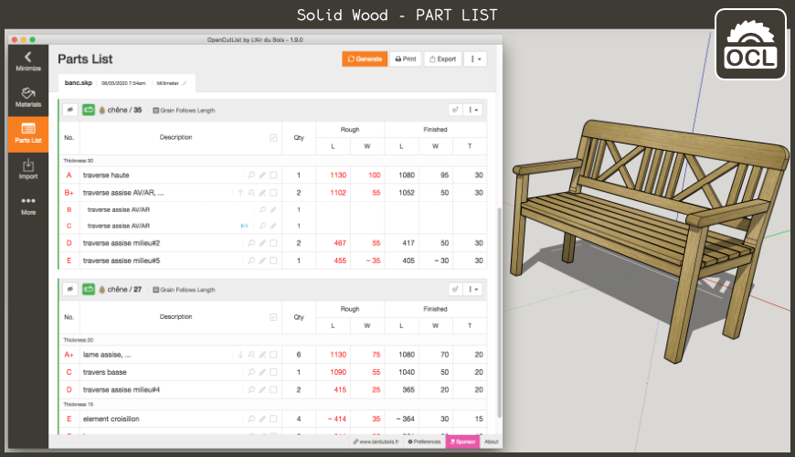
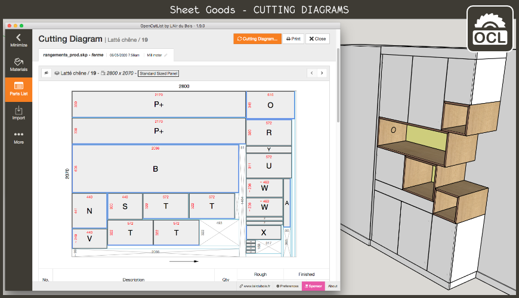
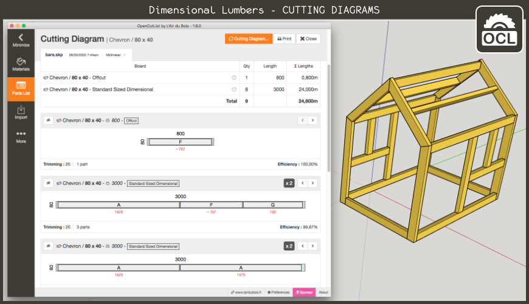
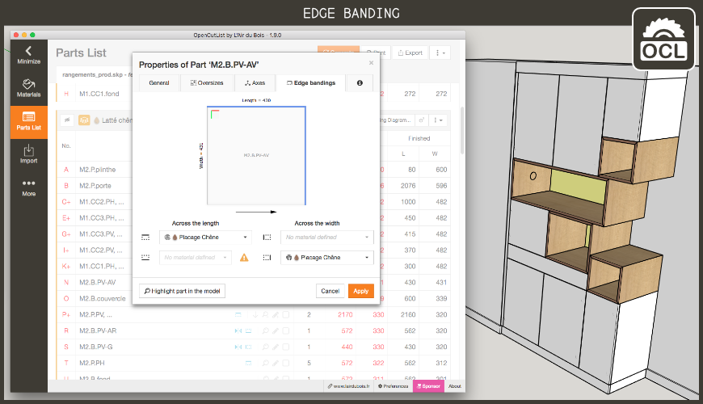

# OpenCutList by L'Air du Bois

**OpenCutList** is a [SketchUp](http://www.sketchup.com) Extension for automating the generation of cut lists and cutting diagrams for woodworking projects.

## Download and Install

You can download and install the ***.rbz** package from the [dist](dist) folder or from its official [Extension Warehouse](https://extensions.sketchup.com/en)'s page :

https://extensions.sketchup.com/extension/00f0bf69-7a42-4295-9e1c-226080814e3e/opencutlist

## Supported Languages

OpenCutList is available in english, french, german, russian and italian. The interface language of the extension can be selected independently of the language version of SketchUp.

We are looking for volunteering translators to spanish, preferably woodworkers already familiar with the extension.

## Supported Units

In addition to the selected SketchUp unit, OpenCutList works with dimensions of solid wood, panels and dimensional lumber in fractional inches, even if the selected SketchUp units are metric and vice versa.

## Tutorials

There are a number of great videos on YouTube about using **OpenCutList** for woodworking projects.

- 🇫🇷 - **Boris Beaulant** - [Conférence de présentation OpenCutList au salon Habitat et Bois - Epinal 2019](https://www.youtube.com/watch?v=gW0FrYRItoc)
- 🇩🇪 - **Johannes Boernsen** - [OpenCutList: Automatische Schnittpläne und Materiallisten mit Sketchup erstellen](https://www.youtube.com/watch?v=55jhInrVzJU)
- 🇺🇸 - **FollowAndrew** - [Generate Cut-list Woodworking 3D SketchUp](https://www.youtube.com/watch?v=yrex6zLv66I)
- 🇩🇪 - **Heiko Reich** - [VLOG \#30 - Stücklisten und Zuschnittpläne in SketchUp erstellen](https://www.youtube.com/watch?v=dLoiFJI9LGQ)
- 🇬🇧 - **Firebird Interiors** - [Cutlists made easy! (Sketchup For Fitted Furniture Makers Part 6)](https://www.youtube.com/watch?v=wswN3mEtsCI)
- 🇵🇱 - **Jarek Ostaszewksi** - [SU11. SketchUp: automatyczna lista elementów i formatek do pocięcia (BOM)](https://www.youtube.com/watch?v=VpPKP2xRbB4)
- 🇨🇴 - **Guillermo Digital Artist** - [Plugin para despiece en SketchUp OpenCutList gratis en español](https://www.youtube.com/watch?v=CLakxzqhbSo)
- 🇪🇸 - **Ab Ovo Estudio** -, [¡Como hacer una lista de piezas y de corte de un mueble en Sketchup!](https://www.youtube.com/watch?v=bTy0m1buLCo)
- 🇪🇨 - **Lar7 Estudio** - [OPTIMIZADOR DE CORTES CON CANTOS PARA MELAMINA EN SKETCHUP PLUGIN](https://www.youtube.com/watch?v=0TB7NLR-uJk)
- 🇧🇷 - **Marceneria Provençal** - [Projetos e planos de corte com OpenCutList no SketchUp](https://www.youtube.com/watch?v=4eUKo0Shp4g)
- 🇷🇺 - **Chipovan** - [Проба создания стола в SketchUp 2019 и OpenCutList](https://www.youtube.com/watch?v=_wPXOvkwYfs)
- 🇧🇬 - **AECO Space** - [Master your SketchUp | SketchUp Woodwork Plugin](https://www.youtube.com/watch?v=dt3CcXmRqy0)

## Contributors

### Code Contributors

This project exists thanks to all the people who contribute.

### Financial Contributors

Become a financial contributor and help us sustain our community. [[Contribute](https://opencollective.com/lairdubois-opencutlist-sketchup-extension/contribute)]

#### Individuals

#### Organizations

Support this project with your organization. Your logo will show up here with a link to your website. [[Contribute](https://opencollective.com/lairdubois-opencutlist-sketchup-extension/contribute)]

## License

This code is under the **GNU GPLv3 license**.

[Read the license](LICENSE).

## Documentation

[Read the documentation](docs/00-index.md).
