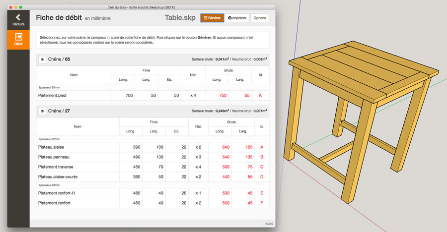
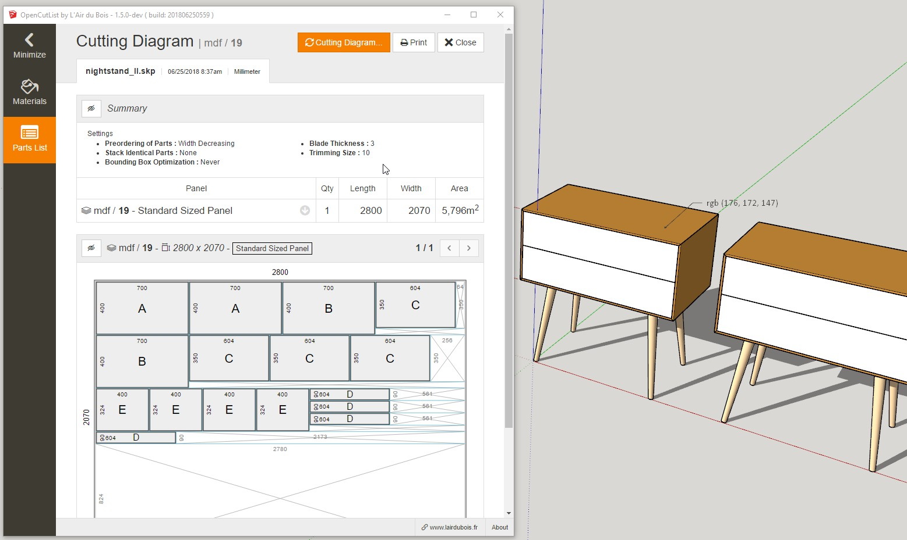

# OpenCutList by L'Air du Bois

**OpenCutList** is a [SketchUp](http://www.sketchup.com) Extension for automating the generation of cut lists and cutting diagrams for woodworking projects.

## Download and Install

You can download and install the ***.rbz** package from the [dist](dist) folder or from its official [Extension Warehouse](https://extensions.sketchup.com/en)'s page :

https://extensions.sketchup.com/en/content/lair-du-bois-sketchup-toolbox-0

## License

This code is under the **GNU GPLv3 license**.

[Read the license](LICENSE).

## Documentation

[Read the documentation](docs/00-index.md).

## Authors

See the list of [contributors](http://github.com/lairdubois/lairdubois-opencutlist-sketchup-extension/contributors).
