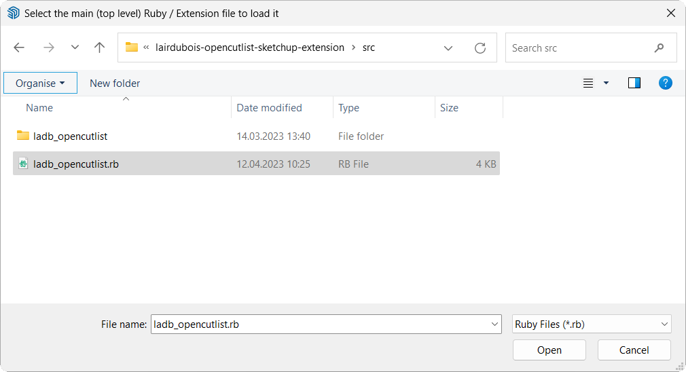

# Development Environment Setup Instructions

To rebuild the plugin, you will first need to install a few tools. The plugin itself is written in **JavaScript** and **ruby**, but the distribution archive `dist/ladb_opencutlist.rbz` is built by a **gulp** task.

The following describes the tools and steps required to successfully create this plugin.

## 1. Getting **Node.js** and **npm**

Download and install [Node.js](https://nodejs.org/en/download/) - *the asynchronous event driven JavaScript runtime*. This will include [npm](https://www.npmjs.com/) - *the package manager for JavaScript*.

Read this short note about [Installing Node](https://docs.npmjs.com/getting-started/installing-node) and make sure you have the latest version of **npm**.

``` bash
    $ node -v
    v20.1.0
    $ npm -v
    9.6.4
    $ npm install npm@latest -g
    $ npm -v
    9.6.6
```

On Windows you *may* also have to install `gulp-cli` to be able to run **gulp** from the command line.

``` bash
     $ npm install gulp-cli -g
```

## 2. Getting the Source Code

The best way to get the project sources is to clone them from the GitHub repository. We assume that you have [Git](https://git-scm.com/) installed on your computer.
This is the preferred way, because updates will be easy to fetch and incorporate into your code.

Move to your project parent folder. Adapt it to your needs and environment.

``` bash
     $ cd /somewhere/on/your/computer
```

And clone the project from sources.

``` bash
     $ git clone git@github.com:lairdubois/lairdubois-opencutlist-sketchup-extension.git
```

Change to the project directory.

``` bash
     $ cd lairdubois-opencutlist-sketchup-extension
```

In the future, if you want to retrieve updates to the sources, execute the git pull command from your project directory.

``` bash
     $ git pull origin master
```

**Caution**, changing files will generate conflicts that you will have to resolve.

## 3. Installing Dependencies

From the project directory, change to the `build/` directory. We have placed a `package.json` file telling **npm** which dependencies to install. You may have to rerun this command after an update to the `package.json` file.

``` bash
    $ cd build
    $ npm install
```
What about warnings? You may get some warnings. `gulp-less` depends on `request` (to be fixed) and many modules rely on `fsevents`, which is only intended for OSX file events.

## 4. Compiling Templates And Distribution Archive

Templates in the `src/ladb_opencutlist/(less|yaml|twig)` directories are compiled by a **gulp** task. If you change any of these files, you will need to recompile the templates.

``` bash
    $ cd build
    $ gulp compile
```

If you wish to build the archive [ladb_opencutlist.rbz](../dist/ladb_opencutlist.rbz), run these commands.

``` bash
    $ cd build
    $ gulp build
```

If you wish to build the development archive, run these commands.

``` bash
    $ cd build
    $ gulp build --env=dev
```

The default behavior of the **gulp** task (without argument) is to *compile* and then *build*.

## 5. Adding a New Language

Note: If you just want to add a new language to **OpenCutList** and you would like to volunteer for the translation, then becoming a translator via [Transifex](https://www.transifex.com/opencutlist/opencutlist/) is a much better way. Your translation may help other users and you will get assistance from the **OpenCutList** team.

Adding a new translation file is simple. Just add a new `.yml` file into the `src/yaml/i18n` directory by duplicating `fr.yml` (or any other file) and changing all the values into the desired language.
The first entry in the file should have the key `_label` corresponding to a label for the new language.

After compiling the project (see 4.), your new language will appear in the **Preferences panel** of **OpenCutList**.

Note: this does **NOT** change the SketchUp language. It may even support a language not supported by SketchUp.

## 6. Use OpenCutList from the Source Folder

### Prerequisite

> To avoid conflicts, you must first uninstall any compiled OpenCutList (*.rbz) installed in you SketchUp environment.

In order to test **OpenCutList**, you do not need to recompile the *.rbz archive every time you make changes. You can run **OpenCutList** directly from the sources.
First, install [AS On-Demand Ruby / Extension Loader](https://alexschreyer.net/projects/plugin-loader-for-sketchup/). This extension is not mandatory, but it will make it easier to load or reload ruby scripts. The extension is also available here [AS On-Demand Ruby / Extension Loader](https://extensions.sketchup.com/extension/cebc698a-855a-4151-a6fd-c334cc2f1a5f/on-demand-ruby-extension-loader).

### Launching

After installing the AS On-Demand Ruby Extension, go to the **Extensions** menu, select **Ruby / Extension Loader** and **Load single Ruby file / extension (RB)**.

<p align="center">

</p>

Browse to and select the `ladb_opencutlist.rb` ruby file from the source folder of **OpenCutList**.

<p align="center">

</p>

That's it. You can now play with **OpenCutList**.

### Reflect Code Changes

#### Ruby Code Changes

**SketchUp loads ruby files once and does not access them thereafter**. To reflect the changes to the ruby code without reloading SketchUp, you must reload the files that were changed (not `ladb_opencutlist.rb` if it was not modified).

Caution! if static or method definitions were changed, you must restart SketchUp and process from scratch.

#### Yaml or Twig Changes

To reflect I18N (yaml) or UI (twig) changes, run the `gulp compile` (see 4.) command, as well as close and reopen the **OpenCutList** dialog in SketchUp.

Enjoy :)
